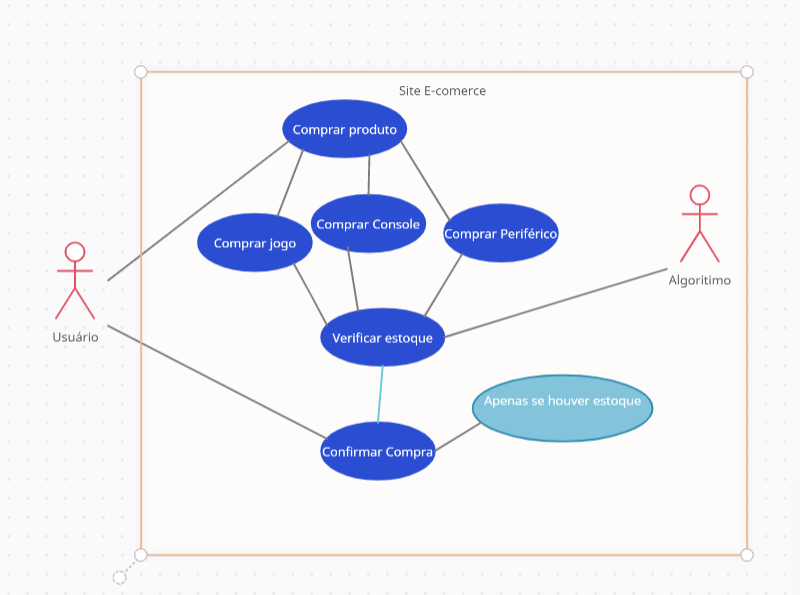

# Game Mania  

## Link do site: [Game Mania]( https://game-mania-br.netlify.app)

## Modelagem caso de uso 

> Este documento de visão de negócio tem como finalidade apresentar uma visão de arquitetura do projeto Game Mania, contendo especificações e restrições de design, a fim de manter o leitor informado sobre o sistema desenvolvido.

 > `Nome`	- Game Mania.

>`Público-alvo` -	Jovens das classes A, B e C que se interessam pelo mundo gamer.

> `Objetivo` -	Proporcionar conhecimento e oferecer produtos de qualidade voltados ao mundo gamer.

>Este projeto visa proporcionar oportunidade de negócio no setor tecnológico, trazendo como vantagens aos consumidores das classes A, B e C, que se interessam pelo mundo gamer, alguns benefícios, como a facilidade de acesso a games, consoles e acessórios.

This project was generated with [Angular CLI](https://github.com/angular/angular-cli) version 13.2.1.

## Development server

Run `ng serve` for a dev server. Navigate to `http://localhost:4200/`. The app will automatically reload if you change any of the source files.

## Code scaffolding

Run `ng generate component component-name` to generate a new component. You can also use `ng generate directive|pipe|service|class|guard|interface|enum|module`.

## Build

Run `ng build` to build the project. The build artifacts will be stored in the `dist/` directory.

## Running unit tests

Run `ng test` to execute the unit tests via [Karma](https://karma-runner.github.io).

## Running end-to-end tests

Run `ng e2e` to execute the end-to-end tests via a platform of your choice. To use this command, you need to first add a package that implements end-to-end testing capabilities.

## Further help

To get more help on the Angular CLI use `ng help` or go check out the [Angular CLI Overview and Command Reference](https://angular.io/cli) page.
